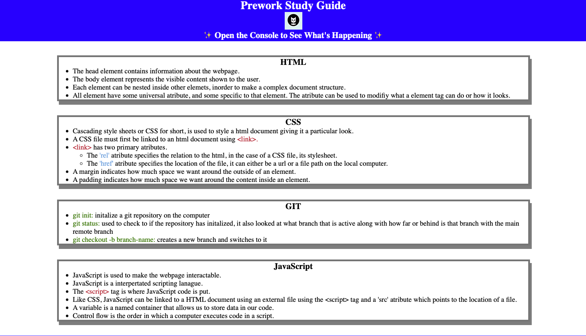

# prework-study-guide

## Description

Provide a short description explaining the what, why, and how of your project. Use the following questions as a guide:

- What was your motivation?
- Why did you build this project? (Note: the answer is not "Because it was a homework assignment.")
- What problem does it solve?
- What did you learn?

I wanted to learn the basics of how a website is made and works. I build this website to understand the full workflow of a web project. I was able to get a good understaing of git version control system and how manage project files.

## Table of Contents (Optional)

If your README is long, add a table of contents to make it easy for users to find what they need.

- [Installation](#installation)
- [Usage](#usage)
- [Credits](#credits)
- [License](#license)

## Installation

Clone the project and then using a webrowser open the index.html file.

## Usage

## Credits

N/A

## License

Refer to the repo license.

